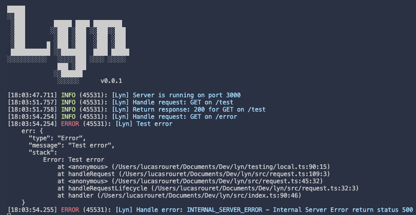

<h1 align='center'>
 Lyn
</h1>

<h3 align='center'>
  <b>Lyn is a lightweight Backend TypeScript framework with Bun.</b>
</h3>

### What and Why Lyn?

Lyn is:

- Fast
- Type-safe
- Secure with built-in authentication
- Runs everywhere

Lyn isn't here to replace existing frameworks. It was born from the need for a
simple way to build things faster, with the best quality and developer experience.

Most frameworks serve as a foundation for your products. However, I often need
something simpler with authentication and security built-in by default.

That's why Lyn focuses on being the easiest tool for POCs, solopreneurs, and agencies.

Lyn leverages Bun and the best JavaScript libraries for the job.

### Code example



Code:

```ts
new Lyn()
  .get("/text", () => {
    return "Hello World";
  })
  .get("/json", () => {
    return {
      message: "Hello World",
    };
  })
  .get(
    "/:name",
    ({ params }) => {
      return {
        message: "Hello " + params.name,
      };
    },
    {
      params: z.object({
        name: z.string(),
      }),
    }
  )
  .get(
    "/test",
    ({ query }) => {
      return {
        message: `Hello ${query.name} ${
          query.isAdmin ? "is admin" : "is not admin"
        } and you are ${query.age} years old`,
      };
    },
    {
      query: z.object({
        name: z.string(),
        isAdmin: z.boolean(),
        age: z.number(),
      }),
    }
  )
  .post("/", ({ set }) => {
    set.status = 201;
    return {
      message: "Hello World",
    };
  })
  .post(
    "/users",
    ({ body, set }) => {
      set.status = 201;
      return {
        message: "Hello " + body.name,
      };
    },
    {
      body: z.object({
        name: z.string(),
      }),
    }
  )
  .listen(3000);
```

### Roadmap:

- [x] Register Routes
- [x] Request lifecycle
- [x] Body validation
- [x] Params validation
- [x] Query validation
- [x] Add a logger
- [ ] Auth
- Do a Security Checklist

### Contact

[X @RouretLucas](https://x.com/RouretLucas)

### License

MIT
